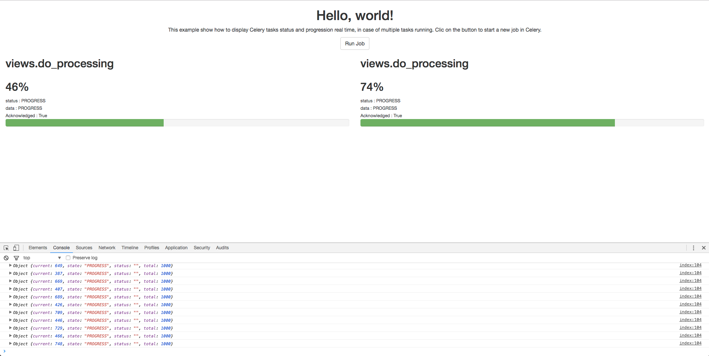

README
======

Small snippet to test the display of Celery tasks in Flask. 
The following code displays every instance of a given tasks running in Celery and their status.




Install
-------
Let's say you name your virtual environnement "flask" :
```
virtualenv flask
source flask/bin/activate
pip install flask
pip install celery
pip install redis
```

Run
---
You must open three terminal windows.

```
on window #1 : redis-server

on window #2, activate the virtualenv and then : celery worker -A views.celery --loglevel=info

on window #3, activate the virtualenv and then : export FLASK_APP=views.py && flask run
```
